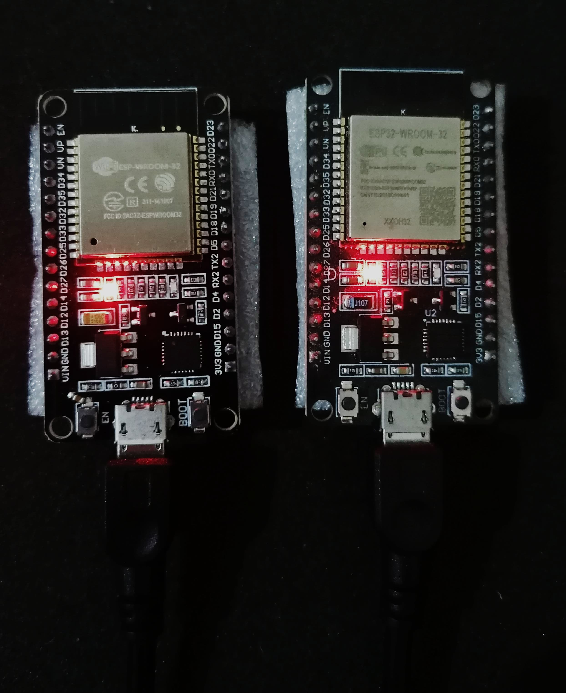
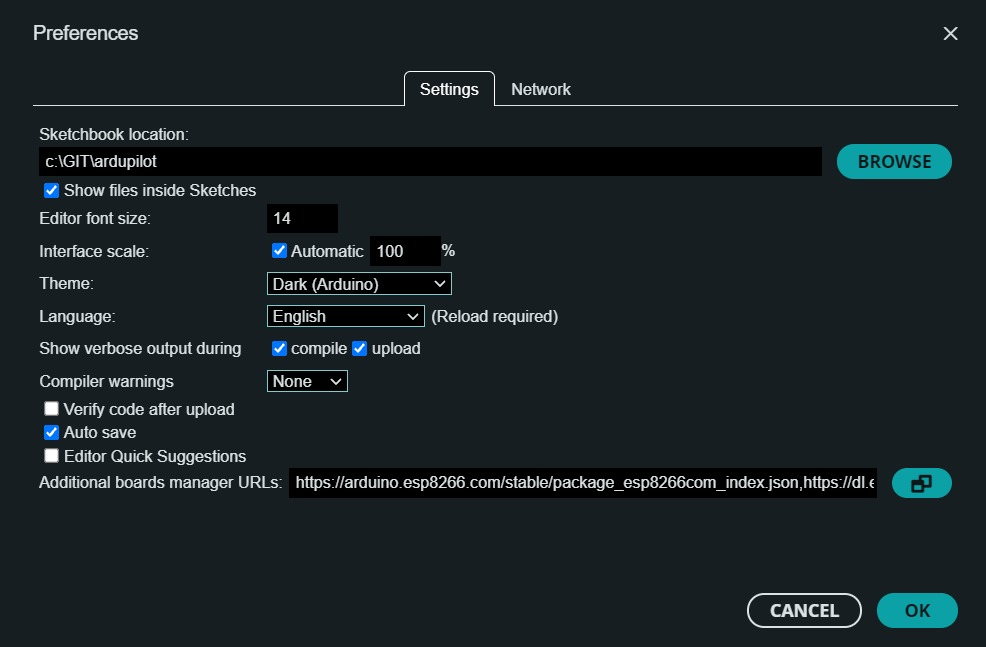

# V2V Communication - EEBL (Electronic Emergency Brake Light) System
## Projenin Amacı
Bu proje, EEBL (Electronic Emergency Brake Light) sistemini simüle ederek, lider aracın ani fren yapma durumunda takip eden araca bu durumu bildiren bir iletişim ağı kurar. Proje, araçlar arası (V2V) iletişim teknolojisini kullanarak, ani fren olaylarını takipçi araca bildirir ve geri bildirim mekanizması ile lider araca bu bilgiyi iletir.

Proje, acil fren olayını tespit eden ve bu bilgiyi başka bir araca ileten bir C++ uygulaması olarak tasarlanmıştır. UDP protokolü üzerinden mesaj iletilir ve iki farklı bilgisayar (lider ve takipçi araçlar) arasında veri alışverişi sağlanır.

## Proje Özeti
Lider araç: Acil fren durumunu algılar ve takip eden araca acil fren mesajı gönderir.
Takipçi araç: Lider aracın acil fren mesajını alır ve lider araca "Acil fren mesajı alındı" geri bildirimi gönderir.
EEBL Olayı Nedir?
EEBL (Electronic Emergency Brake Light), öndeki bir aracın ani fren yapması durumunda, arkasındaki araçlara uyarı gönderen bir güvenlik sistemidir. Bu proje, bu uyarı sistemini V2V iletişimi üzerinden simüle eder. Öndeki aracın hızı, fren pozisyonu, yavaşlama hızı ve iki araç arasındaki mesafe baz alınarak, ani fren durumları takipçi araca iletilir.

### Esp2Esp Uygulama Videosu
[](https://www.youtube.com/watch?v=zpvHljFyYgk)

### Laptop2Laptop Uygulama Videosu
[](https://www.youtube.com/watch?v=ifbe5aF7DuQ)
[](https://www.youtube.com/watch?v=eVpX9cUAlb0)

## Acil Fren Olayı Algoritması
Projede, acil fren olayını tespit etmek için aşağıdaki parametreler kullanılır:

Araç Hızı (speed): 0-90 km/h aralığında. Eğer hız 70 km/h'nin üzerindeyse, acil fren durumu olabilir.

Yavaşlama Hızı (deceleration): 0-10 m/s² aralığında. Yavaşlama hızı 8 m/s²'den büyükse, acil fren durumu olabilir.

Fren Pedalı Pozisyonu (brake_position): 0-100% aralığında. Fren pedal pozisyonu %70'in üzerinde olmalıdır.

İki Araç Arasındaki Mesafe (distance): Mesafe 1000 metreden küçükse ve diğer koşullar sağlanıyorsa acil fren mesajı gönderilir.

Bu koşullar sağlandığında, lider araç takip eden araca "Emergency Brake Activated!" mesajını gönderir.

## Zorluklar ve Potansiyel Çözümler
### 1. UDP Üzerinden Veri İletiminde Güvenilirlik
#### Zorluk: 
UDP protokolü kullanıldığı için veri paketlerinin kaybolma veya yanlış sırada gelme olasılığı bulunuyor. Bu, lider ve takipçi araçlar arasında kritik veri kayıplarına neden olabilir.
#### Çözüm: 
UDP'nin hız avantajından faydalandık, ancak veri kaybını önlemek için gelecekte TCP protokolü gibi daha güvenilir protokoller tercih edilebilir. Alternatif olarak, kaybolan veri paketlerinin yeniden gönderilmesini sağlayan bir geri bildirim mekanizması eklenebilir.
### 2. Ağ Bağlantısının Sağlanması
#### Zorluk:
İki bilgisayarın aynı yerel ağda iletişim kurması sırasında IP çakışmaları veya ağ yapılandırması sorunlarıyla karşılaşıldı.
#### Çözüm:
Aynı IP aralığında olunduğundan emin olmak için ağ yapılandırmaları gözden geçirildi. Ayrıca, UDP iletişimine izin verecek şekilde firewall (güvenlik duvarı) ayarları düzenlendi.
### 3. Gerçek Zamanlı Veri İletiminde Doğrulama Eksikliği
#### Zorluk: 
Lider aracın takipçi araca gönderdiği verilerin doğru ve zamanında alınıp alınmadığından emin olunamadı.
#### Çözüm:
Geri bildirim mekanizması ile lider araca takipçinin veriyi aldığını bildiren bir yapı eklendi.
## Kullanılan Teknolojiler
1. C++: Projenin temel dili olarak seçilmiştir.
2. Winsock2: UDP üzerinden iki bilgisayar arasında veri iletimi yapmak için kullanılır.
3. MinGW: Windows üzerinde C/C++ kodlarını derlemek ve çalıştırmak için kullanılan geliştirme ortamı.
4. ESP32 modülü


   
## Laptop2Laptop Projesini Çalıştırma Adımları
### 1. MinGW Kurulumu
MinGW (Minimalist GNU for Windows) kullanarak projeyi derlemek için şu adımları izleyin:

[MinGW İndir](https://sourceforge.net/projects/mingw/)

Kurulum sırasında g++, make, mingw32-base gibi paketlerin yüklendiğinden emin olun.
### 2. DevC++ IDE Kullanımı
Bu proje, DevC++ kullanılarak geliştirilmiştir. DevC++, MinGW ile entegre çalışan bir geliştirme ortamıdır. Aşağıdaki adımlarla projeyi DevC++ üzerinde çalıştırabilirsiniz:

1. **DevC++ İndirin ve Kurun**: [DevC++ İndir](https://sourceforge.net/projects/orwelldevcpp/).
2. Proje dosyalarını DevC++ üzerinden açın.
3. Projeyi derlemek için MinGW derleyicisini kullanın.

### 3. Projeyi Derlemek ve Çalıştırmak
Bu projede UDP ile veri iletimi sağlamak için Winsock2 kütüphanesi tercih edilmiştir. Winsock2 (Windows Sockets API), Windows işletim sistemlerinde ağ tabanlı uygulamalar geliştirmek için kullanılan bir API'dir ve özellikle UDP/TCP gibi düşük seviyeli ağ protokollerini yönetmek için idealdir. Winsock2, socket programlama yaparken geniş bir özellik seti sunar ve Windows işletim sistemi üzerinde yaygın olarak kullanılmaktadır. Projede veri iletimini etkin ve hızlı bir şekilde gerçekleştirmek için bu kütüphane tercih edilmiştir.

Projeyi derlerken -lws2_32 linker'ını eklemeniz gerekmektedir. Aşağıdaki adımları takip ederek projeyi derleyebilir ve çalıştırabilirsiniz.
Projeyi derlemek için terminal veya komut satırı üzerinden aşağıdaki komutları kullanarak kaynak dosyalarınızı (leader.cpp ve follower.cpp) derleyin:
```cpp
 g++ leader.cpp -o V2V_leader.exe -lws2_32

 g++ follower.cpp -o V2V_follower.exe -lws2_32
```
Derleme işlemi tamamlandıktan sonra programları çalıştırmak için aşağıdaki adımları izleyebilirsiniz.

Öncü Aracı (Leader) Çalıştırma: Lider laptopta terminalde veya komut satırında aşağıdaki komutu çalıştırarak leader programını başlatın:
```cpp
 ./V2V_leader.exe
```
Takipçi Aracı (Follower) Çalıştırma: Takipçi laptopta bir terminal penceresi açarak follower programını başlatmak için şu komutu çalıştırın:
```cpp
 ./V2V_follower.exe
```
### 4. Araç Parametrelerini Girmek
Lider araçta hız, fren pedal pozisyonu, yavaşlama ve konum bilgilerini girin.

Takipçi aracın da konum bilgilerini girin, lider araç acil fren durumunu algılayarak geri bildirimde bulunacaktır.
   
## Esp2Esp Projesini Çalıştırma Adımları
### 1. Arduino IDE Kurulumu
[Arduino IDE İndir](https://www.arduino.cc/en/software)
### 2. Esp32 board manager
Arduino IDE programının "Preferences" sekmesindeki "Additional boards manager URLs" kısmına alttaki linkler eklenir. Sonrasında "Board" olarak kullanılacak Esp modülü seçilir.
```cpp
https://arduino.esp8266.com/stable/package_esp8266com_index.json
https://dl.espressif.com/dl/package_esp32_index.json
```


### 3. UPLOAD
1. V2V_follower.ino dosyasının içindeki kod birinci ESP modülüne yüklenir.
2. V2V_leader.ino dosyasının içindeki kod ikinci ESP modülüne yüklenir.
3. Seri monitörden cihazların durumu takip edilebilir.

### 4. Web Arayüz Bağlantısı
1. Lider aracı temsil eden arayüz için 192.168.1.105 local ip adresine bağlanılarak arayüze erişilebilir. Sliderlar aracılığıyla parametreler değiştirilebilir. "Break" butonu ile parametreler takipçi aracı temsil eden cihaza gönderilir. Eğer parametreler takipçi cihaza başarıyla gönderilirse ekranda bilgi bildirimi açığa çıkar.
2. Takipçi aracı temsil eden arayüz için 192.168.1.106 local ip adresine bağlanılarak arayüze erişilebilir. Lider araçtan gelen parametreler burada görüntülenir. Koşullar sağlandığı takdirde "EMERGENCY BREAK" butonu "Kırmızı"ya döner. 

## Mesaj Akışı
Lider Araç:
Lider araç, takipçiden konum bilgilerini alır, iki araç arasındaki mesafeyi hesaplar ve acil fren koşullarını değerlendirir.
Eğer acil fren durumu algılanırsa, takipçi araca acil fren mesajı gönderir.

Takipçi Araç:
Takipçi araç, lider araçtan gelen acil fren mesajını alır ve bu mesajı aldıktan sonra lider araca Esp2Esp'de  "Mesaj başarıyla alındı", Laptop2Laptop'ta "Takipçi geri bildirimi alındı"  bilgisini geri bildirir.

## Dosya Yapısı
### Laptop2Laptop 
1. leader.cpp: Lider aracın acil fren mesajını gönderen kodu içerir.
2. follower.cpp: Takipçi aracın acil fren mesajını alıp geri bildirimde bulunmasını sağlar.
3. Makefile.win: Projeyi derlemek için kullanılan dosya.
4. .exe dosyaları: Derlenmiş çalıştırılabilir dosyalar.
### Esp2Esp
1. V2V_leader.ino : Lider aracın acil fren mesajını gönderen kodu içerir.
2. V2V_follower.ino : Takipçi aracın acil fren mesajını alıp geri bildirimde bulunmasını sağlar.

## Sonuç
Bu proje, lider ve takipçi araçlar arasında EEBL (Electronic Emergency Brake Light) simülasyonunu başarıyla gerçekleştirir. Lider araç ani fren yaptığında, takipçi araç uyarılır ve lider araca geri bildirim sağlar. Bu proje, V2V iletişiminin nasıl çalıştığını ve UDP protokolü ile hızlı veri iletiminin nasıl sağlanacağını gösterir.
