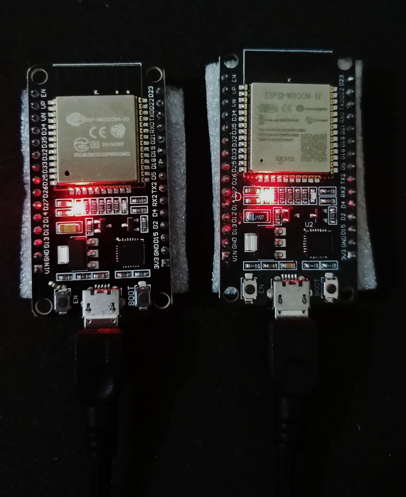
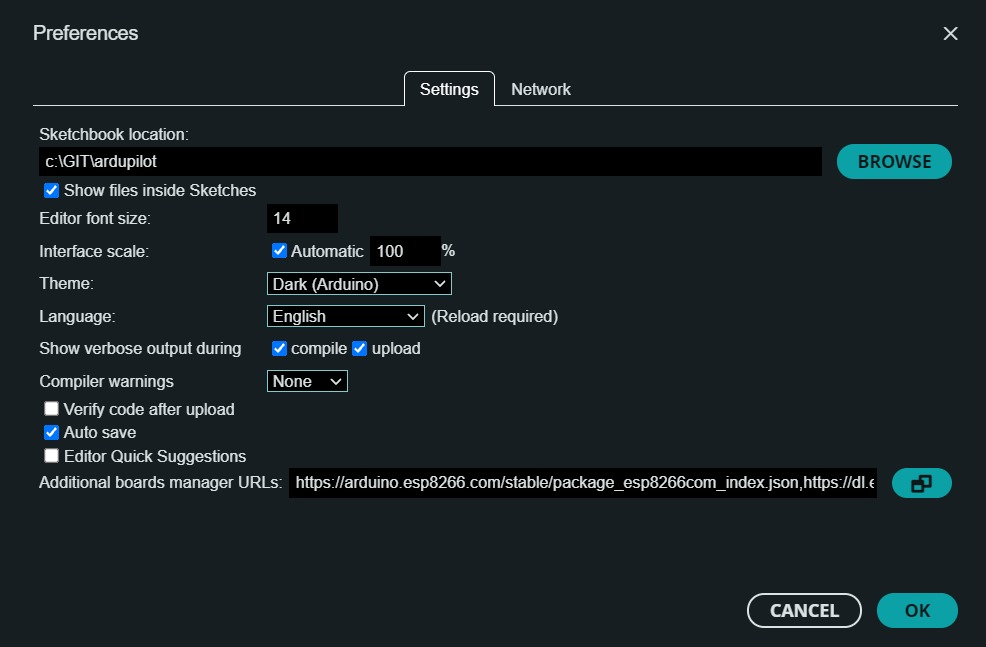

# V2V Communication - EEBL (Electronic Emergency Brake Light) System

## Project Objective
This project simulates the **EEBL (Electronic Emergency Brake Light)** system by establishing a communication network that notifies the following vehicle when the leading vehicle performs sudden braking. The project uses **Vehicle-to-Vehicle (V2V) communication technology** to transmit emergency braking events to the following vehicle and sends feedback back to the leading vehicle.

The project is designed as a **C++ application** that detects an emergency braking event and transmits this information to another vehicle. Messages are transmitted via the **UDP protocol**, enabling data exchange between **two different computers (leader and follower vehicles).**

---

## Project Overview

**Leader vehicle:** Detects an emergency braking event and sends an emergency brake message to the following vehicle.

**Follower vehicle:** Receives the emergency brake message from the leader vehicle and sends a feedback message **"Emergency brake message received"** back to the leader.

### What is an EEBL Event?

EEBL (Electronic Emergency Brake Light) is a safety system that sends warnings to vehicles behind when a leading vehicle performs sudden braking. This project simulates this warning system through **V2V communication**.

Emergency braking events are determined based on:

- Vehicle speed  
- Brake pedal position  
- Deceleration rate  
- Distance between two vehicles  

When the conditions indicate sudden braking, the warning message is transmitted to the following vehicle.

---

## Esp2Esp Application Video

[](https://www.youtube.com/watch?v=zpvHljFyYgk)

---

## Laptop2Laptop Application Video

[](https://www.youtube.com/watch?v=ifbe5aF7DuQ)

[](https://www.youtube.com/watch?v=eVpX9cUAlb0)

---

## Emergency Brake Detection Algorithm

The following parameters are used in the project to detect an emergency braking event:

**Vehicle Speed (speed)**  
Range: **0–90 km/h**  
If the speed exceeds **70 km/h**, an emergency braking situation may occur.

**Deceleration (deceleration)**  
Range: **0–10 m/s²**  
If deceleration exceeds **8 m/s²**, it may indicate emergency braking.

**Brake Pedal Position (brake_position)**  
Range: **0–100%**  
Brake pedal position must exceed **70%**.

**Distance Between Vehicles (distance)**  
If the distance is **less than 1000 meters** and the other conditions are satisfied, an emergency brake message is sent.

When these conditions are met, the leader vehicle sends the message:

```
Emergency Brake Activated!
```

to the following vehicle.

---

# Challenges and Potential Solutions

## 1. Reliability of Data Transmission over UDP

### Challenge
Since the **UDP protocol** is used, there is a possibility of packet loss or packets arriving out of order. This may cause critical data loss between the leader and follower vehicles.

### Solution
The speed advantage of UDP was utilized. However, for improved reliability in the future, **TCP protocol** could be preferred. Alternatively, a **packet retransmission mechanism** could be implemented.

---

## 2. Network Connectivity Issues

### Challenge
When establishing communication between two computers on the same local network, **IP conflicts or network configuration issues** were encountered.

### Solution
Network configurations were checked to ensure both devices were in the **same IP range**. Additionally, **firewall settings** were adjusted to allow UDP communication.

---

## 3. Lack of Verification in Real-Time Data Transmission

### Challenge
There was no guarantee that the data sent from the leader vehicle was received correctly and on time by the follower.

### Solution
A **feedback mechanism** was implemented so the follower vehicle confirms reception of the message.

---


## Running the Laptop2Laptop Project

## 1. Installing MinGW

To compile the project using **MinGW (Minimalist GNU for Windows)**, follow these steps:

[Download MinGW](https://sourceforge.net/projects/mingw/)

During installation, ensure the following packages are installed:

- g++
- make
- mingw32-base

---

## 2. Using DevC++ IDE
This project was developed using **DevC++**, which integrates with MinGW.

Steps to run the project:

1. **Download and install DevC++**  
   https://sourceforge.net/projects/orwelldevcpp/

2. Open the project files in DevC++.

3. Compile the project using the **MinGW compiler**.

---


## Technologies Used

| Technology | Purpose |
|------------|--------|
| C++ | Core application development |
| UDP | Low-latency communication |
| Winsock2 | Network programming in Windows |
| ESP32 | Wireless embedded communication |
| Arduino IDE | ESP32 firmware development |
| MinGW | C++ compilation on Windows |

---

## Hardware

ESP32 microcontrollers are used for embedded communication.



---

## 3. Compiling and Running the Project

To enable UDP communication, the **Winsock2 library** is used.

Winsock2 (Windows Sockets API) is a Windows networking API that enables the development of applications using low-level networking protocols such as **UDP and TCP**.

To compile the project, you must include the **-lws2_32 linker**.

Compile the source files using the following commands:

```bash
g++ leader.cpp -o V2V_leader.exe -lws2_32
g++ follower.cpp -o V2V_follower.exe -lws2_32
```

After compilation, run the programs as follows.

### Running the Leader Vehicle

```bash
./V2V_leader.exe
```

### Running the Follower Vehicle

```bash
./V2V_follower.exe
```

---

## 4. Entering Vehicle Parameters

On the **leader vehicle**, enter:

- Speed
- Brake pedal position
- Deceleration
- Position information

On the **follower vehicle**, enter its position information.

The leader vehicle will detect emergency braking conditions and send a notification accordingly.

---

## Running the Esp2Esp Project

### 1. Installing Arduino IDE

https://www.arduino.cc/en/software

---

### 2. ESP32 Board Manager

In the **Preferences** section of Arduino IDE, add the following URLs to **Additional Boards Manager URLs**:

```bash
https://arduino.esp8266.com/stable/package_esp8266com_index.json
https://dl.espressif.com/dl/package_esp32_index.json
```

Then select the ESP module from the **Board** menu.



---

### 3. Upload

1. Upload the code inside **V2V_follower.ino** to the first ESP module.
2. Upload the code inside **V2V_leader.ino** to the second ESP module.
3. Device status can be monitored via the **Serial Monitor**.

---

### 4. Web Interface Connection

### Leader Vehicle Interface

Access the interface via:

```
192.168.1.105
```

- Parameters can be adjusted using sliders.
- The **Brake** button sends parameters to the follower device.
- If the parameters are successfully transmitted, a notification appears on the screen.

### Follower Vehicle Interface

Access the interface via:

```
192.168.1.106
```

Parameters received from the leader vehicle are displayed here.

If conditions are satisfied, the **"EMERGENCY BRAKE"** button turns **red**.

---

## Message Flow

### Leader Vehicle

The leader vehicle:

- Receives position information from the follower
- Calculates the distance between vehicles
- Evaluates emergency braking conditions

If emergency braking is detected, an emergency message is sent to the follower vehicle.

---

### Follower Vehicle

The follower vehicle:

- Receives the emergency brake message from the leader
- Sends a confirmation back to the leader

Feedback messages:

**Esp2Esp**
```
Message successfully received
```

**Laptop2Laptop**
```
Follower feedback received
```

---

## File Structure

### Laptop2Laptop

1. **leader.cpp** – Sends the emergency brake message from the leader vehicle  
2. **follower.cpp** – Receives the emergency message and sends feedback  
3. **Makefile.win** – Used to compile the project  
4. **.exe files** – Compiled executable files  

---

### Esp2Esp

1. **V2V_leader.ino** – Code for sending emergency brake messages  
2. **V2V_follower.ino** – Code for receiving messages and sending feedback  

---

## Conclusion

This project successfully simulates the **EEBL (Electronic Emergency Brake Light)** system between leader and follower vehicles.

When the leader vehicle performs sudden braking:

- The follower vehicle is warned
- The follower sends confirmation feedback

The project demonstrates how **V2V communication works** and how **fast data transmission can be achieved using the UDP protocol**.
